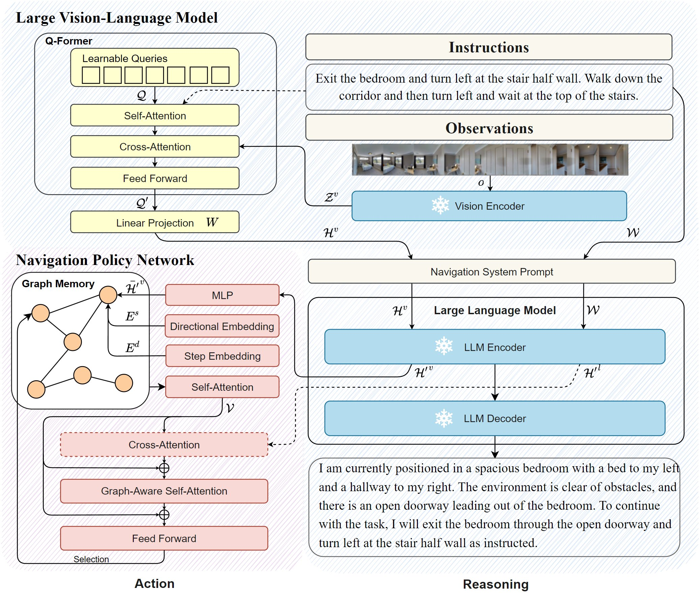

<div align="center">

<h1>🎇NavGPT-2: Unleashing Navigational Reasoning Capability for Large Vision-Language Models</h1>

<div>
    <a href='https://gengzezhou.github.io' target='_blank'>Gengze Zhou<sup>🍕</sup></a>;
    <a href='http://www.yiconghong.me' target='_blank'>Yicong Hong<sup>🌭</sup></a>;
    <a href='https://zunwang1.github.io' target='_blank'>Zun Wang<sup>🍔</sup></a>;
    <a href='https://eric-xw.github.io' target='_blank'>Xin Eric Wang<sup>🌮</sup></a>;
    <a href='http://www.qi-wu.me' target='_blank'>Qi Wu<sup>🍕</sup></a>
</div>
<sup>🍕</sup>AIML, University of Adelaide 
<sup>🌭</sup>Adobe Research 
<sup>🍔</sup>Shanghai AI Laboratory 
<sup>🌮</sup>University of California, Santa Cruz

<br>

<div>
    <a href='https://github.com/GengzeZhou/NavGPT-2' target='_blank'></a>
    <a href='https://arxiv.org/abs/2407.12366' target='_blank'></a>
    <a href="https://opensource.org/licenses/MIT"></a>
    <a href="https://github.com/salesforce/LAVIS"></a>
</div>

</div>


## 🍹 Abstract
 Capitalizing on the remarkable advancements in Large Language Models (LLMs), there is a burgeoning initiative to harness LLMs for instruction following robotic navigation. Such a trend underscores the potential of LLMs to generalize navigational reasoning and diverse language understanding. However, a significant discrepancy in agent performance is observed when integrating LLMs in the Vision-and-Language navigation (VLN) tasks compared to previous downstream specialist models. Furthermore, the inherent capacity of language to interpret and facilitate communication in agent interactions is often underutilized in these integrations. In this work, we strive to bridge the divide between VLN-specialized models and LLM-based navigation paradigms, while maintaining the interpretative prowess of LLMs in generating linguistic navigational reasoning. By aligning visual content in a frozen LLM, we encompass visual observation comprehension for LLMs and exploit a way to incorporate LLMs and navigation policy networks for effective action predictions and navigational reasoning. We demonstrate the data efficiency of the proposed methods and eliminate the gap between LM-based agents and state-of-the-art VLN specialists.

## 🍸 Method


## 🍻 TODOs

- [x] Release 🎇NavGPT-2 policy finetuning code.
- [x] Release visual instruction tuning code.
- [x] Release navigational reasoning data.
- [x] Release pretrained models weights.
- [ ] Release data preparation scripts.

## 🧋 Prerequisites

### 🍭 Installation

Two ways are provided to set up the environment: Conda and Docker, can choose either one according to your preference.

#### Conda Environment
1. Create a conda environment and install all dependencies:

```bash
conda create --name NavGPT2 python=3.8
conda activate NavGPT2
pip install -r requirements.txt
```

2. Install Matterport3D simulator follow instructions [here](https://github.com/peteanderson80/Matterport3DSimulator).

    You could find some hints from the provided [Dockerfile](dockerfile) of how to build the simulator in conda environment :) .

#### Docker Environment

> A Dockerfile is provided to build the environment with all dependencies installed. You can either pull the Docker image directly from Docker Hub or build it yourself using the provided Dockerfile.

1. OPTION 1: Pull the Docker image from Docker Hub:

```bash
docker pull gengzezhou/mattersim-torch2.2.0cu118:v2
docker run -it gengzezhou/mattersim-torch2.2.0cu118:v2 /bin/bash
```

Start a container and run the following lines to make sure you activate the environment:
```bash
source /root/miniconda3/etc/profile.d/conda.s
conda activate
export PYTHONPATH=/root/Matterport3DSimulator/build
```

2. OPTION 2: Build the Docker image from the provided Dockerfile:

```bash
docker build -t navgpt2:v1 .
docker run -it navgpt2:v1 /bin/bash
```

### 🍬 Data Preparation

Download the required data:

```bash
python download.py --data
```

This script will automatically download the following datasets:

1. R2R Data and Pre-computed Image Features ([EVA-CLIP-g](https://github.com/salesforce/LAVIS/blob/ac8fc98c93c02e2dfb727e24a361c4c309c8dbbc/lavis/models/eva_vit.py#L442)):

    Source: [Huggingface Datasets: ZGZzz/NavGPT-R2R](https://huggingface.co/datasets/ZGZzz/NavGPT-R2R)

    Destination: `datasets`

2. Instruction Tuning Data for NavGPT-2:

    Source: [Huggingface Datasets: ZGZzz/NavGPT-Instruct](https://huggingface.co/datasets/ZGZzz/NavGPT-Instruct)

    Destination: `datasets/NavGPT-Instruct`

Unzip the downloaded R2R data:

```bash
cd datasets
cat R2R.zip.* > R2R.zip
unzip R2R.zip
```

The data directory is structed as follows:

```
datasets
├── NavGPT-Instruct
│   ├── NavGPT_train_v1.json
│   └── NavGPT_val_v1.json
└── R2R
    ├── annotations
    ├── connectivities
    └── features
        └── MP3D_eva_clip_g_can.lmdb
```

Alternatively, you can specify the datasets to download by providing the `--dataset` argument to the script. For example, to download only the R2R data:

```bash
python download.py \
    --data \
    --dataset 'r2r'
```

### 🍫 Pretrained Models

Download the pretrained models:

```bash
python download.py --checkpoints
```

This script will automatically download the following pretrained models:

<table border="1" width="100%">
    <tr align="center">
        <th>Model</th><th>Log</th><th colspan="5">R2R unseen</th><th colspan="5">R2R test</th>
    </tr>
    <tr align="center">
        <td></td><td></td><td>TL</td><td>NE</td><td>OSR</td><td>SR</td><td>SPL</td><td>TL</td><td>NE</td><td>OSR</td><td>SR</td><td>SPL</td>
    </tr>
    <tr align="center">
        <td><a href="https://huggingface.co/ZGZzz/NavGPT2-FlanT5-XL/tree/main">NavGPT2-FlanT5-XL</a></td><td><a href="assets/NavGPT2-FlanT5-XL.log">here</a></td><td>12.81</td><td>3.33</td><td>78.50</td><td>69.89</td><td>58.86</td><td>13.51</td><td>3.39</td><td>77.38</td><td>70.76</td><td>59.60</td>
    </tr>
    <tr align="center">
        <td><a href="https://huggingface.co/ZGZzz/NavGPT2-FlanT5-XXL/tree/main">NavGPT2-FlanT5-XXL</a></td><td><a href="assets/NavGPT2-FlanT5-XXL.log">here</a></td><td>14.04</td><td>2.98</td><td>83.91</td><td>73.82</td><td>61.06</td><td>14.74</td><td>3.33</td><td>80.30</td><td>71.84</td><td>60.28</td>
    </tr>
</table>

The checkpoints include the following files:

1. Pretrained NavGPT-2 Q-former weights, will be put in the `map_nav_src/models/lavis/output` directory.

2. Finetuned NavGPT-2 policy weights, will be put in the `datasets/R2R/trained_models` directory.

Alternatively, you can specify the models to download by providing the `--model` argument to the script. For example, to download only the NavGPT2-FlanT5-XL weights:

```bash
python download.py \
    --checkpoints \
    --model 'xl'
```

## 🧃 Stage 1: Visual Instruction Tuning of NavGPT-2

> You could skip this stage and directly use the provided pretrained NavGPT-2 Q-former for policy finetuning.

Set the cache directory in [defaults.yaml](map_nav_src/models/lavis/configs/default.yaml) as the absolute path to NavGPT-2.

Perform visual instruction tuning of NavGPT-2 Q-former with FlanT5-xl:

```bash
cd map_nav_src/models
bash run_script/train_NavGPT_xl.sh
```

Alternatively, you can switch the LLM to `FlanT5-xxl`, `Vicuna-7B`, or `Vicuna-13B` by running the following scripts:

```bash
bash run_script/train_NavGPT_xxl.sh
bash run_script/train_NavGPT_7B.sh
bash run_script/train_NavGPT_13B.sh
```

The training logs and checkpoints will be saved in the `models/lavis/output` directory.

## 🍹 Stage 2: Policy Finetuning of NavGPT-2

Evaluate the trained NavGPT-2 policy with FlanT5-xl on the R2R dataset:

```bash
cd map_nav_src
bash scripts/val_r2r_xl.sh
```

Finetune and evaluate the NavGPT-2 policy with FlanT5-xl on the R2R dataset:

```bash
cd map_nav_src
bash scripts/run_r2r_xl.sh
```

This script will use the released instruction-tuned NavGPT-2 Q-former as initialization. The results will be saved in the `map_nav_src/datasets/R2R/exprs_map/finetune` directory.

Replace the `--qformer_ckpt_path` argument in the `run_r2r_xl.sh` script with the path to the desired NavGPT-2 Q-former checkpoint to finetune the policy with a different model.

Alternatively, you can switch the LLM to `FlanT5-xxl`, `Vicuna-7B`, or `Vicuna-13B` by running the following scripts:

```bash
bash scripts/run_r2r_xxl.sh
bash scripts/run_r2r_vicuna7b.sh
bash scripts/run_r2r_vicuna13b.sh
```

## 🥂 Acknowledgements
We extend our gratitude to MatterPort 3D for their valuable contributions to the open-source platform and community.

We also acknowledge the significant benefits of using [DUET](https://github.com/cshizhe/VLN-DUET) and [InstructBLIP](https://github.com/salesforce/LAVIS/tree/main/projects/instructblip) in this work. Our thanks go out to the creators of these outstanding projects.

## 🍺 Citation

If you find this work helpful, please consider citing:

```bibtex
@article{zhou2024navgpt2,
  title={NavGPT-2: Unleashing Navigational Reasoning Capability for Large Vision-Language Models},
  author={Zhou, Gengze and Hong, Yicong and Wang, Zun and Wang, Xin Eric and Wu, Qi},
  journal={arXiv preprint arXiv:2407.12366},
  year={2024}
}
```
